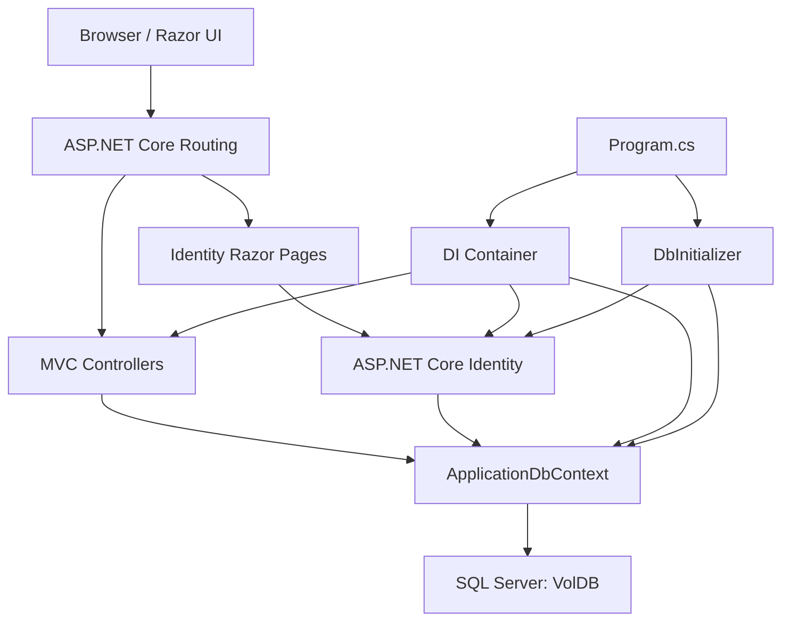
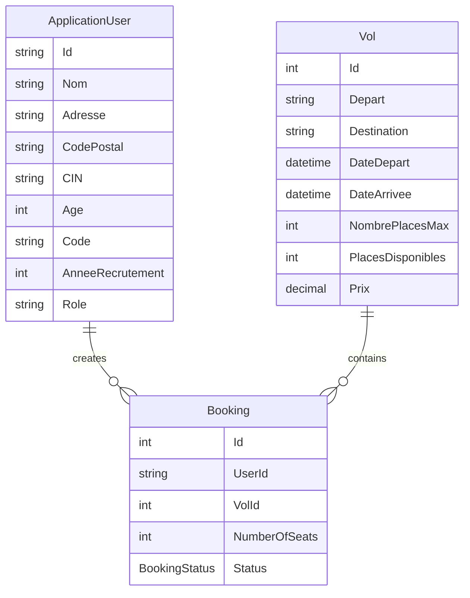
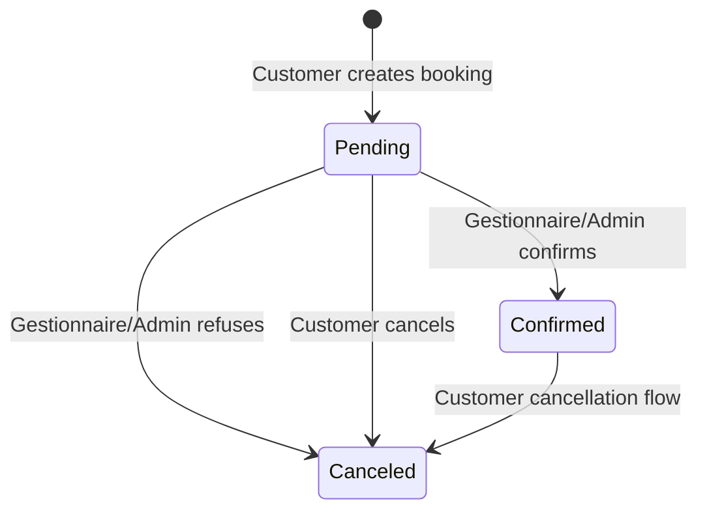

# Flight Booking App

[](https://dotnet.microsoft.com/)
[](https://learn.microsoft.com/aspnet/core)
[](https://learn.microsoft.com/ef/core/)
[](https://www.microsoft.com/sql-server)
[](https://learn.microsoft.com/aspnet/core/security/authentication/identity)
[](https://getbootstrap.com/)


Flight Booking App is an ASP.NET Core MVC web application for searching flights, creating reservations, and administering flight inventory. The system uses ASP.NET Core Identity for authentication and role-based authorization, Entity Framework Core for persistence, SQL Server as the primary database, and Razor views styled with Bootstrap-based assets.

## Table of Contents

- [Overview](#overview)
- [Core Features](#core-features)
- [Technology Stack](#technology-stack)
- [Architecture](#architecture)
- [Domain Model](#domain-model)
- [Authorization Model](#authorization-model)
- [Project Structure](#project-structure)
- [Configuration](#configuration)
- [Getting Started](#getting-started)
- [Database Initialization](#database-initialization)
- [Operational Notes](#operational-notes)
- [Screenshots](#screenshots)

## Overview

The application is organized around three operational areas:

- Public flight discovery through the `Vol` listing and search workflow.
- Customer reservations, including booking creation, booking history, and cancellation.
- Back-office administration for flight management, booking approval, booking refusal, and gestionnaire account management.

The runtime entry point is `src/Program.cs`. It registers MVC controllers, Razor Pages, Identity, Facebook authentication, EF Core SQL Server persistence, cookie paths, and a no-op email sender implementation used by Identity UI flows.

## Core Features

### Customer Workflow

- Browse and search available flights by departure city, destination, departure date, and arrival date.
- Reserve one or more seats on a selected flight.
- Track personal bookings by status: `Pending`, `Confirmed`, or `Canceled`.
- Cancel an existing booking and restore seat availability.
- Register and sign in through ASP.NET Core Identity pages.

### Gestionnaire Workflow

- Create, edit, and delete flights.
- Review reservations across all customers.
- Confirm or refuse pending booking requests.
- View reservation counters for total, pending, confirmed, and canceled bookings.

### Administrator Workflow

- Access all gestionnaire capabilities.
- Create and delete gestionnaire accounts.
- Seed and manage application roles: `Admin`, `Gestionnaire`, and `Client`.

## Technology Stack

| Layer | Technology |
| --- | --- |
| Runtime | .NET 8 |
| Web Framework | ASP.NET Core MVC with Razor Pages |
| Authentication | ASP.NET Core Identity, cookie authentication, Facebook external login |
| Authorization | Role-based policies through `[Authorize(Roles = "...")]` |
| ORM | Entity Framework Core |
| Database | SQL Server through `DefaultConnection` |
| UI | Razor views, Bootstrap, jQuery validation |
| Static Assets | `wwwroot` CSS, JavaScript, images, and vendored libraries |
| Deployment Output | `publish/` folder and Visual Studio publish profiles |

## Architecture

The application follows a conventional ASP.NET Core MVC architecture:



### Request Flow

1. HTTP requests are routed through ASP.NET Core middleware configured in `Program.cs`.
2. Static files are served from `wwwroot`.
3. Authentication and authorization middleware evaluate the current Identity principal and assigned roles.
4. MVC routes dispatch requests to controllers such as `VolController`, `GestionnaireController`, and `HomeController`.
5. Controllers query or update the database through `ApplicationDbContext`.
6. Razor views render HTML using controller-provided models, `ViewBag`, and `TempData` messages.

### Key Components

| Component | Responsibility |
| --- | --- |
| `Program.cs` | Service registration, middleware pipeline, routing, Identity setup, database seeding trigger |
| `ApplicationDbContext` | EF Core context, Identity store integration, domain `DbSet` declarations, seed data |
| `DbInitializer` | Creates roles and the default admin account during startup |
| `VolController` | Flight CRUD, flight search, customer bookings, reservation approval workflow |
| `GestionnaireController` | Admin-only gestionnaire user management |
| `ApplicationUser` | Identity user extension with profile and role-specific fields |
| `Booking` | Reservation aggregate linking a user to a flight and booking status |
| `Vol` | Flight inventory record with route, timing, capacity, availability, and price |
| `EmailSender` | Identity `IEmailSender` implementation placeholder |

## Domain Model



### Booking Lifecycle



When a customer creates a booking, the requested seats are immediately deducted from `Vol.PlacesDisponibles`. If the booking is canceled or refused, those seats are restored.

## Authorization Model

| Role | Capabilities |
| --- | --- |
| Anonymous | View public pages and browse/search flights |
| Client | Create bookings, view personal bookings, cancel own bookings |
| Gestionnaire | Manage flights and process reservations |
| Admin | Manage flights, process reservations, and manage gestionnaire accounts |

Role checks are enforced in controllers with attributes such as:

```csharp
[Authorize(Roles = "Gestionnaire,Admin")]
[Authorize(Roles = "Client")]
[Authorize(Roles = "Admin")]
```

## Project Structure

```text
.
|-- README.md
|-- screenshots/
|-- publish/
`-- src/
    |-- Areas/Identity/Pages/       # Scaffolded ASP.NET Core Identity UI
    |-- Controllers/                # MVC controllers
    |-- Data/                       # EF Core context and database initializer
    |-- Migrations/                 # EF Core migrations
    |-- Models/                     # Domain and view models
    |-- Properties/                 # Launch profiles and publish settings
    |-- Utility/                    # Role constants and email sender
    |-- Views/                      # Razor MVC views
    |-- wwwroot/                    # Static files, CSS, JS, images, libraries
    |-- Program.cs                  # Application composition root
    |-- VolApp.csproj
    `-- VolApp.sln
```

## Configuration

The default SQL Server connection string is defined in `src/appsettings.json`:

```json
"ConnectionStrings": {
  "DefaultConnection": "Server=.\\sqlexpress;Database=VolDB;Trusted_Connection=True;TrustServerCertificate=True"
}
```

For local development, update `DefaultConnection` if your SQL Server instance name differs from `.\\sqlexpress`.

External Facebook authentication is registered in `Program.cs`. For production deployments, move provider credentials to user secrets, environment variables, Azure Key Vault, or another secure configuration provider.

## Getting Started

### Prerequisites

- .NET 8 SDK
- SQL Server or SQL Server Express
- Visual Studio 2022, Rider, or the .NET CLI

### Run Locally

```powershell
cd src
dotnet restore
dotnet build
dotnet run
```

The default launch profiles expose:

- HTTP: `http://localhost:5293`
- HTTPS: `https://localhost:7295`
- IIS Express: `http://localhost:5265` with SSL on `44379`

## Database Initialization

At startup, `DbInitializer.Initialize(...)` performs local bootstrap work:

- Ensures the database exists.
- Creates the `Admin`, `Gestionnaire`, and `Client` roles when missing.
- Creates a default admin account when missing.

Default seeded admin credentials in the current code:

| Field | Value |
| --- | --- |
| Email | `admin@mail.com` |
| Password | `Test-123` |

For production or shared environments, replace these credentials and use secure secret management.

The repository also includes EF Core migrations under `src/Migrations/` for schema history and database evolution.

## Operational Notes

- Booking status is represented by the `BookingStatus` enum: `Pending`, `Confirmed`, and `Canceled`.
- Seat availability is updated as part of booking creation, cancellation, and refusal workflows.
- `EmailSender` currently returns `Task.CompletedTask`; configure a real email provider before enabling production-grade email confirmation and account recovery.
- Identity confirmation is enabled with `RequireConfirmedAccount = true`; the seeded admin is explicitly marked as confirmed.
- The current search implementation loads flights before applying filters. For larger datasets, move filters into the EF Core query to execute them in SQL.
- The `publish/` directory contains generated deployment output and is not part of the primary source architecture.

## Screenshots


